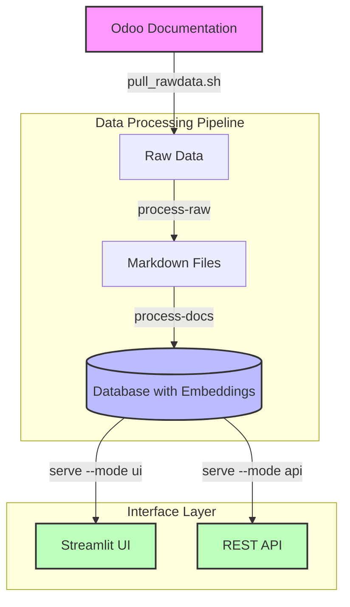

# Odoo Expert
*This project is based on: https://github.com/MFYDev/odoo-expert with changes made to use Gemini LLM instead of ChatGPT*

RAG-Powered Odoo Documentation Assistant

Intro, Updates & Demo Video: https://fanyangmeng.blog/introducing-odoo-expert/

Browser extension now available for Chrome and Edge!

Check it out: https://microsoftedge.microsoft.com/addons/detail/odoo-expert/mnmapgdlgncmdiofbdacjilfcafgapci

> ⚠️ PLEASE NOTE:
> This project is not sponsored or endrosed by Odoo S.A. or Odoo Inc. yet. I am developing this project as a personal project with the intention of helping the Odoo community on my own.

A comprehensive documentation processing and chat system that converts Odoo's documentation to a searchable knowledge base with an AI-powered chat interface. This tool supports multiple Odoo versions (16.0, 17.0, 18.0) and provides semantic search capabilities powered by Google Gemini embeddings.

## Initial Intention Behind This Project

The project was conceived with the vision of enhancing the Odoo documentation experience. The goal was to create a system similar to Perplexity or Google, where users could receive AI-powered answers directly within the documentation website, complete with proper source links. This eliminates the need for users to manually navigate through complex documentation structures.

## How it works?



The system operates through a pipeline of data processing and serving steps:

1. **Documentation Pulling**: Fetches raw documentation from Odoo's repositories
2. **Format Conversion**: Converts RST files to Markdown for better AI processing
3. **Embedding Generation**: Processes Markdown files and stores them with embeddings
4. **Interface Layer**: Provides both UI and API access to the processed knowledge base

## Features

### Core Functionality

- Documentation Processing: Automated conversion of RST to Markdown with smart preprocessing
- Semantic Search: Real-time semantic search across documentation versions
- AI-Powered Chat: Context-aware responses with source citations
- Multi-Version Support: Comprehensive support for Odoo versions 16.0, 17.0, and 18.0
- Always updated: Efficiently detect and process documentation updates.

### Interface Options

- Web UI: Streamlit-based interface for interactive querying
- REST API: Authenticated endpoints for programmatic access
- CLI: Command-line interface for document processing and chat

## Prerequisites

- Docker and Docker Compose
- PostgreSQL with pgvector extension
- Google API access
- Git

if you want to do source install, you need to install the following dependencies:

- Python 3.10+
- Pandoc
- PostgreSQL with pgvector extension

## Installation & Usage

Assuming the table name is `odoo_docs`. If you have a different table name, please update the table name in the following SQL commands.

### Docker Compose Install

1. Download the [docker-compose.yml](./docker-compose.yml) file to your local machine.
2. Set up environment variables in the `.env` file by using the `.env.example` file as a template.
   ```bash
    GOOGLE_API_KEY=your_google_api_key
    POSTGRES_USER=odoo_expert
    POSTGRES_PASSWORD=your_secure_password
    POSTGRES_DB=odoo_expert_db
    POSTGRES_HOST=db
    POSTGRES_PORT=5432
    LLM_MODEL=gemini-1.5-flash-latest
    BEARER_TOKEN=comma_separated_bearer_tokens
    CORS_ORIGINS=http://localhost:3000,http://localhost:8501,https://www.odoo.com
    ODOO_VERSIONS=16.0,17.0,18.0
    SYSTEM_PROMPT=same as .env.example
    # Data Directories
    RAW_DATA_DIR=raw_data
    MARKDOWN_DATA_DIR=markdown
   ```
3. Run the following command:
    ```bash
    docker-compose up -d
    ```
4. Pull the raw data and write to your PostgreSQL's table:
    ```bash
    # Pull documentation (uses ODOO_VERSIONS from .env)
    docker compose run --rm odoo-expert ./pull_rawdata.sh

    # Convert RST to Markdown
    docker compose run --rm odoo-expert python main.py process-raw

    # Process documents
    docker compose run --rm odoo-expert python main.py process-docs
    ```
5. Access the UI at port 8501 and the API at port 8000
6. Docker compose will automatically pull the latest changes and update the system once a day, or you can manually update by running the following command:
    ```bash
    docker compose run --rm odoo-expert python main.py check-updates
    ```

### Source Install

1. Install PostgreSQL and pgvector:
    ```bash
    # For Debian/Ubuntu
    sudo apt-get install postgresql postgresql-contrib
    
    # Install pgvector extension
    git clone https://github.com/pgvector/pgvector.git
    cd pgvector
    make
    make install
    ```

2. Create database and enable extension:
    ```sql
    CREATE DATABASE odoo_expert;
    \c odoo_expert
    CREATE EXTENSION vector;
    ```

3. Set up the database schema by running the SQL commands in `src/sqls/init.sql`.

4. Create a `.env` file from the template and configure your environment variables:
    ```bash
    cp .env.example .env
    # Edit .env with your settings including ODOO_VERSIONS and SYSTEM_PROMPT
    ```

5. Pull Odoo documentation:
    ```bash
    chmod +x pull_rawdata.sh
    ./pull_rawdata.sh  # Will use ODOO_VERSIONS from .env
    ```

6. Convert RST to Markdown:
    ```bash
    python main.py process-raw
    ```

7. Process and embed documents:
    ```bash
    python main.py process-docs
    ```

8. Launch the chat interface:
    ```bash
    python main.py serve --mode ui
    ```

9. Launch the API:
    ```bash
    python main.py serve --mode api
    ```

10. Access the UI at port 8501 and the API at port 8000

11. To sync with the latest changes in the Odoo documentation, run:
    ```bash
    python main.py check-updates
    ```

## API Endpoints

The project provides a REST API for programmatic access to the documentation assistant.

### Authentication

All API endpoints require Bearer token authentication. Add your API token in the Authorization header:
```bash
Authorization: Bearer your-api-token
```

### Endpoints

POST `/api/chat`
Query the documentation and get AI-powered responses.

Request body:
```json
{
    "query": "string",        // The question about Odoo
    "version": integer,       // Odoo version (160, 170, or 180)
    "conversation_history": [ // Optional
        {
            "user": "string",
            "assistant": "string"
        }
    ]
}
```

Response:
```json
{
    "answer": "string",       // AI-generated response
    "sources": [              // Reference documents used
        {
            "url": "string",
            "title": "string"
        }
    ]
}
```

Example:
```bash
curl -X POST "http://localhost:8000/api/chat" \
-H "Authorization: Bearer your-api-token" \
-H "Content-Type: application/json" \
-d '{
    "query": "How do I install Odoo?",
    "version": 180,
    "conversation_history": []
}'
```

POST `/api/stream`
Query the documentation and get AI-powered responses in streaming format.

Request body:
```json
{
    "query": "string",        // The question about Odoo
    "version": integer,       // Odoo version (160, 170, or 180)
    "conversation_history": [ // Optional
        {
            "user": "string",
            "assistant": "string"
        }
    ]
}
```

Response:
Stream of text chunks (text/event-stream content type)

Example:
```bash
curl -X POST "http://localhost:8000/api/stream" \
-H "Authorization: Bearer your-api-token" \
-H "Content-Type: application/json" \
-d '{
    "query": "How do I install Odoo?",
    "version": 180,
    "conversation_history": []
}'
```

## Browser Extension Setup

The project includes a browser extension that enhances the Odoo documentation search experience with AI-powered responses. To set up the extension:

1. Open Chrome/Edge and navigate to the extensions page:
   - Chrome: `chrome://extensions/`
   - Edge: `edge://extensions/`

2. Enable "Developer mode" in the top right corner

3. Click "Load unpacked" and select the `browser-ext` folder from this project

4. The Odoo Expert extension icon should appear in your browser toolbar

5. Make sure your local API server is running (port 8000)

The extension will now enhance the search experience on Odoo documentation pages by providing AI-powered responses alongside the traditional search results.

## Future Roadmap

Please see [GitHub Issues](https://github.com/MFYDev/odoo-expert/issues) for the future roadmap.


## Support
If you encounter any issues or have questions, please:

- Check the known issues
- Create a new issue in the GitHub repository
- Provide detailed information about your environment and the problem

> ⚠️ **Please do not directly email me for support, as I will not respond to it at all, let's keep the discussion in the GitHub issues for clarity and transparency.**

## Contributing
Contributions are welcome! Please feel free to submit a Pull Request.

Thanks for the following contributors during the development of this project:

- [Viet Din (Desdaemon)](https://github.com/Desdaemon): Giving me important suggestions on how to improve the performance.

## License

This project is licensed under [Apache License 2.0](./LICENSE): No warranty is provided. You can use this project for any purpose, but you must include the original copyright and license.

Extra license [CC-BY-SA 4.0](./LICENSE-DOCS) to align with the original Odoo/Documentation license.
